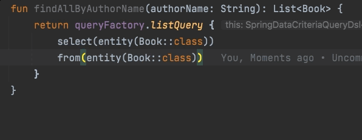
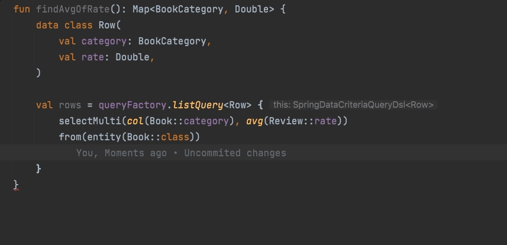

# Kotlin JDSL
<a href="https://codecov.io/gh/line/kotlin-jdsl">
  
</a>
&nbsp;<a href="https://github.com/line/kotlin-jdsl/contributors"></a>&nbsp;
<a href="https://search.maven.org/search?q=g:com.linecorp.kotlin-jdsl%20AND%20a:kotlin-jdsl-core"></a>&nbsp;
<a href="https://github.com/line/kotlin-jdsl/commits"></a>

Kotlin JDSL is DSL for JPA Criteria API without generated metamodel and reflection. It helps you write a JPA query like
writing an SQL statement.

### Background

There are several libraries in the easy way to use JPA. However, those libraries have to use APT. If you use APT, there is a problem that you have to compile again when the name or type of entity field is changed. So, in order not to use APT, we created this library using the KProperty created by the kotlin compiler.

If you want to know more about the background of Kotlin JDSL, I recommend reading
the [blog](https://engineering.linecorp.com/en/blog/kotlinjdsl-jpa-criteria-api-with-kotlin/)

## Quick start - JPA 2.2

### Reactive
If you are interested in JPA Reactive See [more](./reactive-core/README.md)

### Hibernate

Add Hibernate Kotlin JDSL and Hibernate to dependencies

```kotlin
dependencies {
    implementation("com.linecorp.kotlin-jdsl:hibernate-kotlin-jdsl:x.y.z")
    implementation("org.hibernate:hibernate-core:x.y.z")
}
```

### Eclipselink
Add Eclipselink Kotlin JDSL and Eclipselink to dependencies

```kotlin
dependencies {
    implementation("com.linecorp.kotlin-jdsl:eclipselink-kotlin-jdsl:x.y.z")
    implementation("org.eclipse.persistence:org.eclipse.persistence.jpa:x.y.z")
}
```

### Quick Start - JPA 3.0

* Currently, Hibernate Reactive Does not support JPA 3.0

### Hibernate

Add Hibernate Kotlin JDSL and Hibernate to dependencies

```kotlin
dependencies {
    implementation("com.linecorp.kotlin-jdsl:hibernate-kotlin-jdsl-jakarta:x.y.z")
    implementation("org.hibernate:hibernate-core:6.y.z") // up to 6 version
}
```

### Eclipselink
Add Eclipselink Kotlin JDSL and Eclipselink to dependencies

```kotlin
dependencies {
    implementation("com.linecorp.kotlin-jdsl:eclipselink-kotlin-jdsl-jakarta:x.y.z")
    implementation("org.eclipse.persistence:org.eclipse.persistence.jpa:4.y.z") // up to 4 version
}
```

Create QueryFactory using EntityManager

```kotlin
val queryFactory: QueryFactory = QueryFactoryImpl(
    criteriaQueryCreator = CriteriaQueryCreatorImpl(entityManager),
    subqueryCreator = SubqueryCreatorImpl()
)
```

Query using it

```kotlin
queryFactory.listQuery<Entity> {
    select(entity(Book::class))
    from(entity(Book::class))
    where(column(Book::id).equal(1000))
}
```

### Spring Data
If you use Spring Boot & Data Frameworks
See [more](./spring/README.md)

## Usage

You can easily write query using Entity associations.



If you want to return the DTO, use the DTO as the return type.


### Query

QueryFactory allows you to create JPA queries using DSL just like SQL queries.

```kotlin
val books: List<Book> = queryFactory.listQuery {
    select(entity(Book::class))
    from(entity(Book::class))
    where(column(Book::author).equal("Shakespeare"))
}
```

#### with nullable condition

Kotlin JDSL converts `null` in `where condition` to `EmptyPredicateSpec` object.

_note that `EmptyPredicateSpec` turns into `1=1` sql_

```kotlin
val books: List<Book> = queryFactory.listQuery {
        select(entity(Book::class))
        from(entity(Book::class))
        where(
            name?.run { column(Book::author).equal(this) }
        )
    }
```

#### with multi conditions

You can chain conditions using the `whereAnd` or `whereOr` method.
* `whereAnd` connects each condition with `and`, `whereOr` connects with `or`.
* Each method is connected by `and`.

```kotlin
val books: List<Book> = queryFactory.listQuery {
    select(entity(Book::class))
    from(entity(Book::class))
    whereOr(
        column(Book::author).equal("Dan Brown"),
        column(Book::author).equal("Hemingway")
    )
    whereAnd(
        column(Book::viewCount).greaterThan(10000L),
        column(Book::isBorrowed).isFalse()
    )
}
```

### DTO Projections
If you want to select the DTO, select columns in the order of constructor parameters.

#### select
```kotlin
data class Row(
    val author: String,
    val count: Long, 
)

val books: List<Row> = queryFactory.listQuery {
    select(listOf(column(Book::author), count(column(Book::id))))
    from(entity(Book::class))
    groupBy(column(Book::author))
}
```

#### selectMulti
```kotlin
data class Row(
    val author: String,
    val count: Long, 
)

val books: List<Row> = queryFactory.listQuery {
    selectMulti(column(Book::author), count(column(Book::id)))
    from(entity(Book::class))
    groupBy(column(Book::author))
}
```

### Update & Delete

Users can perform bulk update/delete through update/delete query.
* kotlin-jdsl's update/delete does not require from clause. Type T given as generic handles from automatically.
* According to the JPA specification, update/delete does not support join, fetch, group by, order by, limit.
* If you want to use an association mapping as a where condition, you must use [associate](#associate).

```kotlin
val query: Query = queryFactory.updateQuery<Order> {
    where(col(Order::purchaserId).`in`(1000, 2000))
    setParams(col(Order::purchaserId) to 3000)
}

val updatedRowsCount: Int = query.executeUpdate()

val deleteQuery: Query = queryFactory.deleteQuery<Order> {
    where(col(Order::purchaserId).`in`(1000, 2000))
}

val deletedRowsCount: Int = deleteQuery.executeUpdate()
```


### Expression

Kotlin JDSL supports various expressions.

#### Aggregation

```kotlin
val max = max(column(Book::price))
val count = count(column(Book::price))
val greatest = greatest(column(Book::createdAt))
```

#### Case When

```kotlin
val case = case(
    `when`(column(Book::name).like("A%")).then(literal(1)),
    `when`(column(Book::name).like("B%")).then(literal(2)),
    // ...
    `else` = literal(999)
)
```

#### Subquery

```kotlin
val authorIds = queryFactory.subquery<Long> {
    select(column(Book::authorId))
    from(entity(Book::class))
    // ...
}

val authors: List<Author> = queryFactory.listQuery {
    // ...
    where(column(Author::id).`in`(authorIds))
}
```

#### NestedColumn(Foreign Key)

You can use the `nestedCol` function to get the `foreign Key` value.

```kotlin
val orderIdsInOrderGroupTable = queryFactory.listQuery {
    select(nestedCol(col(OrderGroup::order), Order::id))
    from(entity(OrderGroup::class))
}
```

You can get the value of `foreign Key` using `nested`, an extension function in `ColumnSpec`.

```kotlin
val orderIdsInOrderGroupTable = queryFactory.listQuery<Long> {
    select(col(OrderGroup::order).nested(Order::id))
    from(entity(OrderGroup::class))
}
```

### Predicate

Kotlin JDSL supports various predicates.

```kotlin
val condition = and(
    column(Book::author).equal("Shakespeare"),
    column(Book::price).lessThanOrEqualTo(100.toBigDecimal()),
    column(Book::status).`in`(SALE, OUT_OF_STOCK),
    column(Book::createdAt).between(Time.of("2001-01-01"), Time.of("2010-12-31")),
)
```

### Join

```kotlin
val books = queryFactory.listQuery<Book> {
    select(entity(Book::class))
    from(entity(Book::class))
    join(Book::author) //Default is `JoinType.INNER`
    join(Book::publisher, JoinType.LEFT)
    join(Book::seller, JoinType.RIGHT)
    // ...
}
```

#### Fetch

```kotlin
val books = queryFactory.listQuery<Book> {
    select(entity(Book::class))
    from(entity(Book::class))
    fetch(Book::author)
    // ...
}
```

If join and fetch are used together for the same entity, only fetch is applied.

```kotlin
val books = queryFactory.listQuery<Book> {
    select(entity(Book::class))
    from(entity(Book::class))
    join(Book::author) // Join is ignored
    fetch(Book::author) // Only fetch is applied
    // ...
}
```

#### Cross Join

```kotlin
val books = queryFactory.listQuery<Book> {
    select(entity(Book::class))
    from(entity(Book::class))
    join(entity(Author::class), on(column(Book::authorId).equal(column(Author::id))))
    // ...
}
```

#### Exists

Subquery exists expression

```kotlin
val orders = queryFactory.listQuery {
    val entity: EntitySpec<Order> = entity(Order::class)
    select(entity)
    from(entity)
    where(
        exists(queryFactory.subquery<Long> {
            val orderGroupEntity = entity(OrderGroup::class)
            select(literal(1))
            from(orderGroupEntity)
            where(
                and(
                    col(OrderGroup::orderGroupName).equal("orderGroup1"),
                    col(OrderGroup::order).equal(entity)
                )
            )
        })
    )
}
```

Subquery not exists expression

```kotlin
val orders = queryFactory.listQuery {
    val entity: EntitySpec<Order> = entity(Order::class)
    select(entity)
    from(entity)
    where(
        notExists(queryFactory.subquery<Long> {
            val orderGroupEntity = entity(OrderGroup::class)
            select(literal(1))
            from(orderGroupEntity)
            where(
                and(
                    col(OrderGroup::orderGroupName).equal("orderGroup1"),
                    col(OrderGroup::order).equal(entity)
                )
            )
        })
    )
}
```

#### Alias

There may be models with the two associations of same type. In this case, separate the Entity using alias.

```kotlin
val orders = queryFactory.listQuery<Order> {
    select(entity(Order::class))
    from(entity(Order::class))
    join(entity(Order::class), entity(Address::class, alias = "shippingAddress", on(Order::shippingAddress)))
    join(entity(Order::class), entity(Address::class, alias = "receiverAddress", on(Order::receiverAddress)))
    // ...
}
```

#### associate

associate behaves similarly to join, and operates exactly the same as join in select, and since Join cannot be used in update/delete, use associate to associate the relationship with other internally mapped objects (ex: @Embedded) You can build it and run the query.

```kotlin
val query = queryFactory.selectQuery<String> {
    select(col(Address::zipCode))
    from(entity(OrderAddress::class))
    associate(OrderAddress::class, Address::class, on(OrderAddress::address))
}

val updatedRowCount = queryFactory.updateQuery<OrderAddress> {
    where(col(OrderAddress::id).equal(address1.id))
    associate(OrderAddress::class, Address::class, on(OrderAddress::address))
    set(col(Address::zipCode), "test")
    set(col(Address::baseAddress), "base")
}.executeUpdate()

val deletedRowCount = queryFactory.deleteQuery<OrderAddress> {
    where(col(OrderAddress::id).equal(address1.id))
    associate(OrderAddress::class, Address::class, on(OrderAddress::address))
}.executeUpdate()
```

#### Treat (Downcasting)

There may be situations where you need to downcast when using an Entity of an inheritance structure. In that case, you can use the code like below.


```kotlin
val employees = queryFactory.listQuery<Employee> {
    selectDistinct(entity(Employee::class))
    from(entity(Employee::class))
    treat<Employee, PartTimeEmployee>()
    where(
        col(PartTimeEmployee::weeklySalary).lessThan(1000.toBigDecimal()),
    )
}
```

If you are downcasting from the root entity (Project Entity in this case) that contains an entity with inheritance structure, you can do it as follows.

```kotlin
val projects = queryFactory.listQuery<Project> {
    selectDistinct(entity(Project::class))
    from(entity(Project::class))
    
    treat<Employee, FullTimeEmployee>(col(Project::employees))
    where(
        col(FullTimeEmployee::annualSalary).greaterThan(100000.toBigDecimal())
    )
}
```

For Hibernate, the issue at [issue](https://discourse.hibernate.org/t/jpa-downcast-criteria-treat-vs-jpql-treat/2231) is currently unresolved and an additional inner(left) join is added to make the result It may come out as a duplicate. 
So you should always apply distinct to select above like examples

--> It works normally after hibernate 6(jakarta) version. If you are using kotlin-jdsl JPA 3.0 or later, no problem.

If you are using Hibernate and want to fetch downcasting entities, the query cannot be executed normally. That is, the example below will result in a runtime error because of this [issue](https://discourse.hibernate.org/t/can-fetch-be-used-as-parameter-of-treat-for-downcasting/3301).

```kotlin
val sub = queryFactory.subquery<Long> {
    select(col(Project::id))
    from(entity(Project::class))

    treat<Employee, FullTimeEmployee>(col(Project::employees))
    treat<Employee, PartTimeEmployee>(col(Project::employees))
    where(
        or(
            col(FullTimeEmployee::annualSalary).greaterThan(100000.toBigDecimal()),
            col(PartTimeEmployee::weeklySalary).greaterThan(1000.toBigDecimal()),
        )
    )
}
val projects = queryFactory.listQuery<Project> {
    val project = Project::class.alias("dedupeProject")
    selectDistinct(project)
    from(project)
    val supervisor = Employee::class.alias("super")
    val partTimeSuper = PartTimeEmployee::class.alias("partSuper")
    // If you are using Hibernate and want to fetch downcasting entities, the query cannot be executed normally. That is, the example below will result in a runtime error.
    fetch(project, supervisor, on(Project::supervisor))
    treat(ColumnSpec<PartTimeEmployee>(project, Project::supervisor.name), supervisor, partTimeSuper)
    where(
        and(
            col(project, Project::id).`in`(sub),
            col(partTimeSuper, PartTimeEmployee::weeklySalary).equal(900.toBigDecimal()),
        )
    )
}
```

If you want to use downcasting entity in select clause, Eclipselink does not support that function. An example is as follows.

--> Since hibernate 6 (jakarta) version, it does not work normally like eclipselink. This feature is not available if you are using kotlin-jdsl JPA 3.0 or higher.

```kotlin
val employees = queryFactory.listQuery<FullTimeEmployee> {
    val project: EntitySpec<Project> = Project::class.alias("project")
    val fullTimeEmployee = FullTimeEmployee::class.alias("fe")
    val employee = Employee::class.alias("e")

    selectDistinct(fullTimeEmployee)
    from(project)
    treat(ColumnSpec<FullTimeEmployee>(project, Project::employees.name), employee, fullTimeEmployee)
    where(
        ColumnSpec<BigDecimal>(fullTimeEmployee, FullTimeEmployee::annualSalary.name)
            .greaterThan(100000.toBigDecimal())
    )
}

```

The Entity structure corresponds to the following structure.

```kotlin
@Inheritance(strategy = InheritanceType.SINGLE_TABLE)
@Entity
@Table(name = "employee")
@DiscriminatorColumn(name = "EMP_TYPE")
class Employee(
    @Id
    @GeneratedValue
    val id: Long,
    val name: String
) {
    override fun equals(other: Any?) = Objects.equals(id, (other as? Employee)?.id)
    override fun hashCode() = Objects.hashCode(id)
}

@Entity
@Table(name = "fulltime_employee")
@DiscriminatorValue("F")
class FullTimeEmployee(
    val annualSalary: BigDecimal,
    override val id: Long,
    override val name: String
) : Employee(id, name) {
    override fun equals(other: Any?) = Objects.equals(id, (other as? FullTimeEmployee)?.id)
    override fun hashCode() = Objects.hashCode(id)
}

@Entity
@Table(name = "parttime_employee")
@DiscriminatorValue("P")
class PartTimeEmployee(
    val weeklySalary: BigDecimal,
    override val id: Long,
    override val name: String
) : Employee(id, name) {
    override fun equals(other: Any?) = Objects.equals(id, (other as? PartTimeEmployee)?.id)
    override fun hashCode() = Objects.hashCode(id)
}

@Entity
@Table(name = "contract_employee")
@DiscriminatorValue("C")
class ContractEmployee(
    val hourlyRate: BigDecimal,
    override val id: Long,
    override val name: String
) : Employee(id, name) {
    override fun equals(other: Any?) = Objects.equals(id, (other as? ContractEmployee)?.id)
    override fun hashCode() = Objects.hashCode(id)
}

@Entity
@Table(name = "project")
class Project(
    @Id
    @GeneratedValue
    val id: Long = 0,
    val name: String,

    @OneToMany(cascade = [CascadeType.ALL])
    val employees: List<Employee>,

    @OneToOne(cascade = [CascadeType.ALL], optional = false, fetch = FetchType.LAZY)
    val supervisor: Employee
) {
    override fun equals(other: Any?) = Objects.equals(id, (other as? Project)?.id)
    override fun hashCode() = Objects.hashCode(id)
}

```


## How it works

Kotlin's property reference provides KProperty interface. KProperty is created in java file at kotlin
compile time. Since KProperty has the name of property, we can use it to write the expression of the Critical API.

If you type the JPA query as below,

```kotlin
queryFactory.listQuery<Book> {
    select(entity(Book::class))
    from(entity(Book::class))
    where(column(Book::name).equal("Hamlet").and(column(Book::author).equal("Shakespeare")))
}
```

Kotlin compiler creates PropertyReference.

```java
final class ClassKt$books$1 extends PropertyReference1Impl {
    public static final KProperty1 INSTANCE = new ClassKt$books$1();

    books$1() {
        super(Book.class, "name", "getName()Ljava/lang/String;", 0);
    }

    @Nullable
    public Object get(@Nullable Object receiver) {
        return ((Book) receiver).getName();
    }
}

final class ClassKt$books$2 extends PropertyReference1Impl {
    public static final KProperty1 INSTANCE = new ClassKt$books$2();

    ClassKt$books$2() {
        super(Book.class, "author", "getAuthor()Ljava/lang/String;", 0);
    }

    @Nullable
    public Object get(@Nullable Object receiver) {
        return ((Book) receiver).getAuthor();
    }
}
```

## Support

If you have any questions, please make Issues. And PR is always welcome.

## We Are Hiring
Are you ready to join us? - <https://careers.linecorp.com/ko/jobs/862>

## How to contribute
See [CONTRIBUTING](CONTRIBUTING.md).
If you believe you have discovered a vulnerability or have an issue related to security, please contact the maintainer directly or send us an [email](mailto:dl_oss_dev@linecorp.com) before sending a pull request.

## License
```
   Copyright 2021 LINE Corporation

   Licensed under the Apache License, Version 2.0 (the "License");
   you may not use this file except in compliance with the License.
   You may obtain a copy of the License at

       http://www.apache.org/licenses/LICENSE-2.0

   Unless required by applicable law or agreed to in writing, software
   distributed under the License is distributed on an "AS IS" BASIS,
   WITHOUT WARRANTIES OR CONDITIONS OF ANY KIND, either express or implied.
   See the License for the specific language governing permissions and
   limitations under the License.
```
See [LICENSE](LICENSE) for more details.

# Our Lovely Contributors
See [the complete list of our contributors](https://github.com/line/kotlin-jdsl/contributors).

<a href="https://github.com/line/kotlin-jdsl/graphs/contributors">
  
</a>
