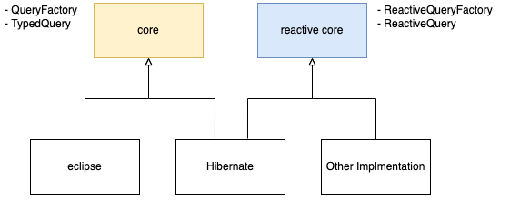
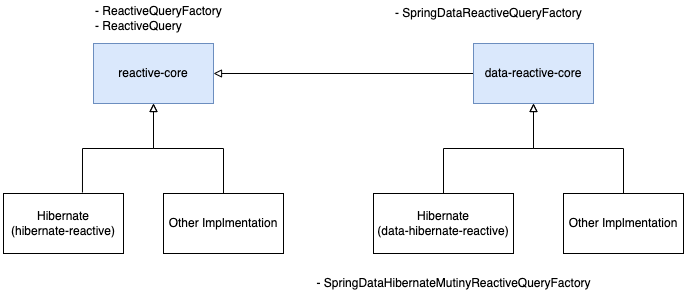

# Kotlin JDSL Reactive

Kotlin JDSL Reactive is a module in Kotlin JDSL that generates Reactive based JPA queries without Metamodel and Reflection.

## Introduction

Currently, there is no JPA standard for Reactive.  
However, the only Reactive implementation of JPA, [hibernate-reactive](https://hibernate.org/reactive) exists.  
so, our implementation of Kotlin JDSL Reactive is heavily inspired by hibernate-reactive.  
For reactive-core module, there is no dependency on hibernate reactive, so the minimum JDK version is 8 same as the existing core module.  
However, the minimum specification for hibernate reactive is [hibernate-reactive#compatibility](https://github.com/hibernate/hibernate-reactive#compatibility) JDK 11.  
As a result, all modules related to hibernate-reactive of jdsl must be JDK 11 or higher to use normally.

The current Reactive module has the following structure.



Also, our module supports Spring Data (Pageable, Range.Bound), and the structure of the module including Spring Data is as follows.



Why did we come up with this structure? Please refer to this [Wiki](https://github.com/line/kotlin-jdsl/wiki/Support-Reactive-JPA)

Currently, Other Implementation corresponding to the above figure is not supported by Eclipselink, another JPA standard that we are supporting.   
However, please note that the structure shown in the figure above was created in consideration of future scalability.

## About Kotlin JDSL Reactive JPA Implementation
As mentioned in [Introduction](#introduction), there is currently no Reactive JPA standard, so we created interfaces called ReactiveQuery and ReactiveQueryFactory to support other extensible reactive implementations including Hibernate.

ReactiveQuery is as below.

```kotlin
interface ReactiveQuery<R> {
    val singleResult: CompletionStage<R>
    val resultList: CompletionStage<List<R>>
    val singleResultOrNull: CompletionStage<R?>
    val executeUpdate: CompletionStage<Int>
    fun setParameter(position: Int, value: Any?): ReactiveQuery<R>
    fun setParameter(name: String, value: Any?): ReactiveQuery<R>
    fun <T> setParameter(parameter: Parameter<T>, value: T?): ReactiveQuery<R>
    fun setMaxResults(maxResults: Int): ReactiveQuery<R>
    fun setFirstResult(firstResult: Int): ReactiveQuery<R>
    fun setQueryHint(hintName: String, value: Any)
    val maxResults: Int
    val firstResult: Int
    fun <T : Any> unwrap(type: KClass<T>): T
}
```

As written above, ReactiveQuery is similar to JPA 2.2's [TypedQuery](https://docs.oracle.com/javaee/6/api/javax/persistence/TypedQuery.html), but with many missing parts.  
It is also similar to Hibernate's [ReactiveQuery](https://hibernate.org/reactive/documentation/1.1/javadocs/org/hibernate/reactive/session/ReactiveQuery.html), but similarly, many parts are omitted.  
If so, what should you do with the rest of the query methods used in JPA or Hibernate?   
The answer is right there in the unwrap method.  
You can check the example code using unwrap in the description a little further below.  

Next, we introduce you to ReactiveQueryFactory.  
Overall, it's not very different from the QueryFactory you were aware of,

```kotlin
interface ReactiveQueryFactory {
    fun <T> selectQuery(returnType: Class<T>, dsl: CriteriaQueryDsl<T>.() -> Unit): ReactiveQuery<T>
    
    fun <T : Any> updateQuery(target: KClass<T>, dsl: CriteriaUpdateQueryDsl.() -> Unit): ReactiveQuery<T>
    
    fun <T : Any> deleteQuery(target: KClass<T>, dsl: CriteriaDeleteQueryDsl.() -> Unit): ReactiveQuery<T>
    
    fun <T> subquery(returnType: Class<T>, dsl: SubqueryDsl<T>.() -> Unit): SubqueryExpressionSpec<T>
}
```

ReactiveQueryFactoryImpl, the only implementation of ReactiveQueryFactory, has the following structure.

```kotlin
class ReactiveQueryFactoryImpl(
    private val criteriaQueryCreator: ReactiveCriteriaQueryCreator,
    private val subqueryCreator: SubqueryCreator,
) : ReactiveQueryFactory {
    override fun <T> selectQuery(
        returnType: Class<T>,
        dsl: CriteriaQueryDsl<T>.() -> Unit
    ): ReactiveQuery<T> =
        criteriaQueryCreator.createQuery(ReactiveQueryDslImpl(returnType).apply(dsl).createCriteriaQuerySpec())

    override fun <T : Any> updateQuery(
        target: KClass<T>,
        dsl: CriteriaUpdateQueryDsl.() -> Unit
    ): ReactiveQuery<T> =
        ...

    override fun <T : Any> deleteQuery(
        target: KClass<T>,
        dsl: CriteriaDeleteQueryDsl.() -> Unit
    ): ReactiveQuery<T> =
        ...

    override fun <T> subquery(
        returnType: Class<T>,
        dsl: SubqueryDsl<T>.() -> Unit
    ): SubqueryExpressionSpec<T> =
        ...
}
```

The key to the code above is the ReactiveCriteriaQueryCreator.  
There is currently only one type implementation of ReactiveCriteriaQueryCreator, the Mutiny(Stateless)ReactiveCriteriaQueryCreator class.  
Therefore, we will develop the story based on MutinyReactiveCriteriaQueryCreator.
Please refer to the [Quick Start](#Quick Start) below

## Quick Start

Add Kotlin JDSL Hibernate Reactive related library & Mutiny kotlin

```kotlin
dependencies {
    implementation("com.linecorp.kotlin-jdsl:hibernate-reactive-kotlin-jdsl:x.y.z")
    implementation("org.hibernate.reactive:hibernate-reactive-core:x.y.z")
    implementation("io.smallrye.reactive:mutiny-kotlin:x.y.z")
}
```

For the basic DB operation method using withFactory, refer to the code below.  

```kotlin
fun main() {
    val sessionFactory = Persistence.createEntityManagerFactory("persistenceUnitName")
        .unwrap(Mutiny.SessionFactory::class.java)
    val subqueryCreator: SubqueryCreator = SubqueryCreatorImpl()
    
    // it just an example, runBlocking should not be used in the real world(production code). 
    // All associate with asynchronously code must be a suspend function 
    // or run in a chain of asynchronously operated code (like CompletableFuture(Stage), Uni, Mono etc...).
    runBlocking {
        example(sessionFactory, subqueryCreator)
    }
}

suspend fun example(sessionFactory: Mutiny.SessionFactory, subqueryCreator: SubqueryCreator) {
    val queryFactory = HibernateMutinyReactiveQueryFactory(
        sessionFactory = factory, subqueryCreator = subqueryCreator
    )
    val order = Order(...initialize code)
    sessionFactory.withSession { session -> session.persist(order).flatMap { session.flush() } }
        // awaitSuspending method is io.smallrye.reactive:mutiny-kotlin library's "coroutine await" extension
        // you should add dependency in build.gradle.kts like below
        // implementation("io.smallrye.reactive:mutiny-kotlin:${mutinyVersion}")
        .awaitSuspending() 
    val actual = queryFactory.withFactory { factory ->
        // You can simply get the query result through the extension method of ReactiveQueryFactory in ReactiveQueryFactoryExtensions.
        val firstOrder = factory.singleQuery<Order> {
            select(entity(Order::class))
            from(entity(Order::class))
            where(col(Order::purchaserId).equal(5000))
        }
        // You must obtain and process the final result of all DB processing in the withFactory method with a non blocking method such as await, not a blocking method such as get() or join(). 
        // Persistence context and DB connection are valid only within withFactory {} scope.        
        .await()

        // You can check all the execution results within this withFactory scope. 
        // One thing to keep in mind is that it is recommended not to write code that can block in this scope or that can consume CPU operation for a long time. 
        // Your production server will most likely be down.
        assertThat(firstOrder.id).isEqualTo(order.id)

        // In the case of this method, as above, the result must be obtained within the withFactory {} scope to complete the processing normally.
        // As a result of executing this method, the Order object is eventually returned as actual.
        factory.singleQuery<Order> {
            select(entity(Order::class))
            from(entity(Order::class))
            where(col(Order::purchaserId).equal(5000))
        }.await()
    }

    assertThat(actual.id).isEqualTo(order.id)
    sessionFactory.close()
}

```

If you want DB transaction guarantee, you can write the code below.

```kotlin
@Test
fun testTransaction(): Unit = runBlocking {
    val order = Order(...initialize code)
    persist(order)

    val factory = HibernateMutinyReactiveQueryFactory(
        sessionFactory = factory,
        subqueryCreator = SubqueryCreatorImpl()
    )
    try {
        factory.transactionWithFactory { queryFactory ->
            val orders = queryFactory.listQuery<Order> {
                select(entity(Order::class))
                from(entity(Order::class))
                fetch(Order::groups)
                fetch(OrderGroup::items)
                fetch(OrderGroup::address)
            }.await()

            // First, the update is done within the transaction. Before committing, of course.
            queryFactory.updateQuery<Order> {
                where(col(Order::id).equal(orders.first().id))
                set(col(Order::purchaserId), orders.first().purchaserId + 1)
            }.executeUpdate.await()
            
            // Afterwards, if an exception occurs while executing another operation, all operations that occurred in withTransaction {} are rolled back.
            queryFactory.updateQuery<Order> {
                throw IllegalStateException("transaction rollback")
            }.executeUpdate.await()
        }
    } catch (e: IllegalStateException) {
        assertThat(e).hasMessage("transaction rollback")
    }

    // When I checked whether the transaction rollback was really done, wow! This test actually passes.
    assertThat(producer.transactionWithFactory { queryFactory ->
        queryFactory.singleQuery<Order> {
            select(entity(Order::class))
            from(entity(Order::class))
            fetch(Order::groups)
            fetch(OrderGroup::items)
            fetch(OrderGroup::address)
            where(col(Order::id).equal(order.id))
        }.await()
    }).isEqualTo(order)
    Unit
}

```

If you want to perform DB operations while using Hibernate's Session directly, you can use withSession(or withTransaction) as shown below.

```kotlin
@Test
fun executeSessionWithFactory() = runBlocking {
    val sessionFactory = Persistence.createEntityManagerFactory("persistenceUnitName")
        .unwrap(Mutiny.SessionFactory::class.java)
    val queryFactory = HibernateMutinyReactiveQueryFactory(
        sessionFactory = factory, subqueryCreator = SubqueryCreatorImpl()
    )
    val order = Order(...initialize code)
    val actual = queryFactory.withFactory { session, factory ->
        // Similarly, all operations should be non-blocking using awaitSuspend when receiving and processing a session. 
        // Never use get() or join().
        session.persist(order).awaitSuspending()
        session.flush().awaitSuspending()

        factory.singleQuery<Order> {
            select(entity(Order::class))
            from(entity(Order::class))
            where(col(Order::purchaserId).equal(5000))
        }.await()
    }

    assertThat(actual.id).isEqualTo(order.id)
}
```

If you want to get a single query result without requiring multiple operations in one session, you can write a simpler code to solve it.

```kotlin
@Test
fun listQuery(): Unit = runBlocking {
    val order = Order(...initialize code)
    persist(order)

    val queryFactory = HibernateMutinyReactiveQueryFactory(
        sessionFactory = factory,
        subqueryCreator = SubqueryCreatorImpl()
    )

    // This method does not require a call to the await method.
    // This is because you performed listQuery which is an extension method of HibernateMutinyReactiveQueryFactory.
    // Please refer to HibernateMutinyReactiveQueryFactoryExtensions.
    val orders = queryFactory.listQuery<Order> {
        select(entity(Order::class))
        from(entity(Order::class))
        fetch(Order::groups)
        fetch(OrderGroup::items)
        fetch(OrderGroup::address)
    }

    assertThat(orders)
        .containsExactly(order)
}
```

In the above example, since the Persistence Context is immediately terminated within the listQuery method, LazyInitializationException may occur when non-fetched entities are used outside the session.  
Be sure to fetch in advance using methods such as fetch and associate so that an exception does not occur after loading DB data.

If you want to execute logic in parallel inside the withSession or withTransaction or executeSessionWithFactory methods, it is not recommended. For more information, see [hibernate-reactive sessions-and-vertx-contexts](https://github.com/hibernate/hibernate-reactive/blob/main/documentation/src/main/asciidoc/reference/introduction.adoc#sessions-and-vertx-contexts).

You can use the unwrapped Query directly, not the ReactiveQuery we made.

```kotlin
val order = Order(...initialize code)
persist(order)

val factory = HibernateMutinyReactiveQueryFactory(
    sessionFactory = factory,
    subqueryCreator = SubqueryCreatorImpl()
)

val orderItem = factory.withFactory { queryFactory ->
    val query: queryFactory.selectQuery<OrderItem> {
        select(entity(OrderItem::class))
        from(entity(OrderItem::class))
        where(col(OrderItem::id).equal(order.groups.first().items.first().id))
    }
    // You can unwrap the query using ReactiveQuery extension in ReactiveQueryExtensions
    .unwrap<Mutiny.Query<OrderItem>>()

    // After unwrap, you can proceed with the Mutiny.Query you want.
    query.isReadOnly = true

    query.singleResult.awaitSuspending()
}

assertThat(orderItem.id).isEqualTo(order.groups.first().items.first().id)
```

### Spring Data
If you use Spring Boot & Data Frameworks
See [more](../spring/data-reactive-core/README.md)
